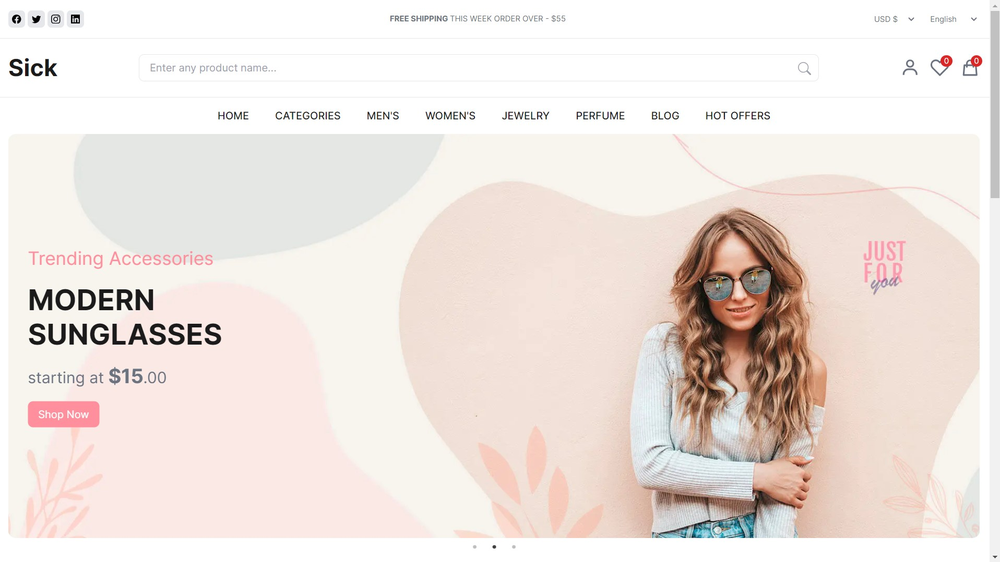

# E-commerce Website Frontend

This project is a frontend application for an e-commerce website built using Next.js. This project serves as my initial learning project for Next.js.

### Live Demo

https://nextjs-ecommerce-frontend.netlify.app/

## Features

- Home page showcasing featured products
- Product listing and details pages

## Screenshots


_Home Page - Showcase of featured products_


_Product Details - Example of a product detail page_

## Technologies Used

- [Next.js](https://nextjs.org/)
- [React](https://reactjs.org/)
- Tailwind CSS

## Getting Started

To get a local copy up and running follow these simple steps.

### Prerequisites

- Node.js and npm installed on your local machine. You can download them from [nodejs.org](https://nodejs.org/).

### Installation

1. Clone the repository:

   ```sh
   git clone https://github.com/your-username/ecommerce-frontend.git

   ```

2. Navigate to the project directory:

   ```sh
   cd ecommerce-frontend

   ```

3. Install the dependencies:

   ```sh
   npm install

   ```

## Running the Application

1. Start the development server:

   ```sh
   npm run dev / npm run start

   ```

2. Open http://localhost:3000 in your browser to see results

## Running the Application with Docker

To run this application using Docker, follow these steps:

### Prerequisites

- Ensure you have Docker installed. You can download it from [Docker's official website](https://www.docker.com/products/docker-desktop).

### Building the Docker Image

1. Navigate to the project directory:

   ```sh
   cd /path/to/your/project
   ```

2. Build the Docker image:

   ```sh
   docker build -t ecommerce-frontend .
   ```

   This command builds the Docker image with the tag ecommerce-frontend. The . denotes the current directory as the build context.

### Running the Docker Container

1. Running the docker container:

   ```sh
   docker run -p 3000:3000 ecommerce-frontend
   ```

   This command runs the container and maps port 3000 on your host machine to port 3000 in the container. Your application will be accessible at http://localhost:3000.

### Stopping the Docker Container

1. Find the running container ID or name:

   ```sh
   docker ps
   ```

2. Stop the container:

   ```sh
   docker stop <your_container_ID>
   ```

   Replace <container_id_or_name> with the actual container ID or name obtained from the docker ps command.

## Contributions

Feel free to contribute to this by forking it, cloning or raising some issues for updation.
